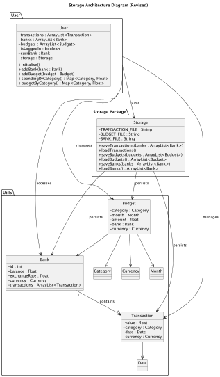
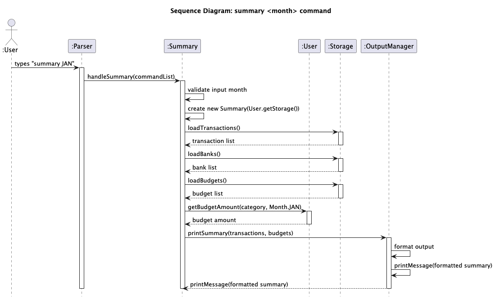
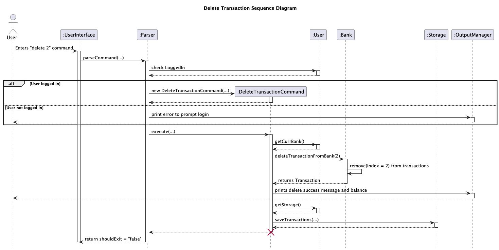

# Developer Guide

## Acknowledgements

We acknowledge: 

 * PlantUML for UML diagram generation 
 * NUS CS2113 teaching team for guidance and templates 

## Design & implementation

### Design 

### Architecture 

The Architecture Diagram given above explains the high-level design of the App. Here is a quick overview of how these components interact with each other: 

'UserInterface' is the main class through which the app runs.

The bulk of the work done by the app is from these four components: 

UserInterface: Is the class from which the programme runs.
Parser: Takes in the command, and calls upon the commands package to execute the commands
User: Serves as a central manager for a user's financial data, such as transactions, budgets and banks
Storage: Reads data from, and writes data to the hard disk.

---

#### UserInterface component
API: UserInterface.java

The `UserInterface` class handles all console-based user interactions for TrackStars.

---

#### Storage component
API: Storage.java 

* The Storage component is responsible for saving and loading user financial data, including banks, budgets, and transactions, from text files.
* Can read the stored data from plain-text (.txt) files (e.g., banks.txt, budgets.txt, transactions.txt) and reconstruct the corresponding Java objects (Bank, Budget, Transaction) during program initialization.
* Acts as a central persistence layer for the application — it provides a single interface for all file input/output operations so that other components (like User) don’t need to handle file management directly.
* Depends on classes in the Domain Model (such as Bank, Transaction, Budget, Category, and Month), because its role is to serialize and deserialize these model objects into storable formats.
* Is used by the User component, which coordinates data loading at startup (User.initialise()) and saving whenever changes are made (e.g., adding a bank or updating budgets).

---

#### User component
API: User.java
The User component manages the user’s interaction with banks, budgets, and transactions. 
It encapsulates user-specific data and operations.  

---

## Implementation 

#### Monthly Summary feature

**Overview**

The Monthly Summary feature enables users to view their spending and budget for each category within a specific month. It is facilitated by the Summary class in the summary package and works closely with the User, Transaction, Category, Month, and OutputManager classes.
When the user enters a command such in the form of summary <month>, the Parser class identifies the command and delegates it to the Summary class via the static method Summary.handleSummary().
This method validates user input, initializes a Summary instance with the user’s current Storage, and invokes Summary.showMonthlySummary(month).
The showMonthlySummary() method performs the following:
Retrieves all transactions from User.getTransactions().
Filters them by the month specified.
For each Category, calculates:
Total spending – the sum of all transactions under that category.
Budget – the user’s allocated budget for that category and month, retrieved via User#getBudgetAmount(cat, monthEnum).
Formats the summarized data through OutputManager.printSummary(). Displays the formatted summary to the user using OutputManager.printMessage().

Given below is an example usage scenario and how the Monthly Summary feature behaves at each step.

Step 1. The user launches the application. Arraylist<> banks, transactions and budgets are initialised via the following:

transactions = storage.loadTransactions();
banks = storage.loadBanks();
budgets = storage.loadBudgets();

Step 2. The user executes the summary <month> command to retrieve a spending summary of the month. For example, summary JAN retrieves the spending summary for the month of January.
The Parser recognises the "summary" keyword and delegates the command handling to Summary.handleSummary(commandlist). Inside handleSummary(), the method validates that the month arguemnt ("JAN") is valid. If valid, it instantiates a new Summary object using the current user's stored data.
Summary summary = new Summary(User.getStorage());

The showMonthlySummary("JAN") method is then called, which filters transactions from User.getTransactions() by month and category, retrieves the relevant budget allocations through User.getBudgetAmount(cat, Month.JAN), and aggregates the results.
The computed totals are passed to OutputManager.printSummary() to format the output, followed by OutputManager.printMessage() to display the results to the user.

The following sequence diagram shows how the summary command goes through the relevant components to display the output to the user.  

The following activity diagram summarises what happens when the user executes summary JAN  

---

#### Delete Transaction Feature

**Overview**

The DeleteTransaction feature allows users to remove a specific transaction from their financial record.
This command improves user flexibility by enabling correction of mistakes or removal of outdated records.  
**Note**: The user must be logged into a bank account to use this command.  
**Syntax:** `delete <transaction-id>`  
Example: `delete 3`
deletes the 3rd transaction listed under the user’s records.

The feature is implemented using the Command Pattern, 
where each user command is represented as a class that implements the `Command` interface.
`DeleteTransactionCommand` is the class responsible for executing the delete operation.

Given below is an example usage scenario and how the delete mechanism behaves at each step.

**Step 1: User launches the application**  
The user starts the program, and all previously saved transactions are 
loaded from `transactions.txt` into memory by the `Storage` class.

**Step 2: The user logs into a bank account**
The user executes the `login INDEX` command to select a bank account.
All subsequent bank-specific commands, such as `delete`, will operate on this account.

**Step 3: The user executes the delete command**  
The user enters: `delete 2`. The Parser identifies `delete` as the command word and checks if the user is logged in.
If logged in, control is passed to the `DeleteTransactionCommand`, with `2` as the argument. 
Otherwise, a `FinanceException` is thrown: `"Please login to a bank to execute this command."`

**Step 4: The command validates the input**    
`DeleteTransactionCommand` checks that: 
- Only one argument is inputted
- The argument is a valid integer. 
- The transaction list is not empty.

If validation passes, execution proceeds.
Otherwise, a FinanceException is thrown, e.g.:  
`Error deleting transaction: Usage: delete <transaction_index>`

**Step 5: The transaction is deleted**  
DeleteTransactionCommand calls: `User.deleteTransaction(index)` on the currently logged-in bank account.  
This method removes the transaction at index 2 from the user’s list. At the same time, ti updates the balance of the logged-in bank account.
It then overwrites `transactions.txt` with the updated list, ensuring persistence across sessions. 
At the same time, The user interface then prints: `"Deleted transaction: ..."`

The following sequence diagram shows how delete operation goes through the components:

The following activity diagram summarizes what happens when a user executes a new command:

---

#### Bank Login Feature 

**Overview**

The bank login feature ensures that user operations (such as adding transactions, budgets, or performing account actions) are scoped to a specific bank account context. By requiring the user to log in to a bank before executing sensitive operations, the system maintains data integrity and simplifies account management. This feature allows users to interact with multiple bank accounts one at a time, with clear authorization boundaries for all financial actions. [file:3]

**Process of Logging Into a Bank**

1. **Login Command Parsing**
    - The user enters a command: `login <bankId>`.
    - The command is parsed and identified as `login` within the Parser class's switch-case structure.
2. **Login Branch Logic**
    - If the user is not already logged in (`User.isLoggedIn == false`):
        - The provided `<bankId>` is parsed from the command arguments.
        - The bank ID is validated against the available bank list (`User.banks`).
        - If the bank exists, set `User.currBank` to that bank and `User.isLoggedIn = true`.
        - Print a success message with the bank’s details.
    - If the user is already logged in, print a message requesting logout before logging in to a different bank.
    - If the bank is not found, a `FinanceException` is thrown and an error message shown. [file:3]

---

**Operations Allowed While Logged In**

The following operations may only be performed after successful bank login, with checks for `User.isLoggedIn`:

| Operation          | How It Is Performed (Command) | Execution Logic                                                                          |
|--------------------|-------------------------------|------------------------------------------------------------------------------------------|
| Add Transaction    | `add <args>`                  | Creates and Executes `AddTransactionCommand`.                                            |
| Delete Transaction | `delete <args>`               | Creates and Executes `DeleteTransactionCommand`.                                         |
| Deposit Funds      | `deposit <args>`              | Creates and Executes `ATM` command in deposit mode for current bank.                     |
| Withdraw Funds     | `withdraw <args>`             | Creates and Executes `ATM` command in withdraw mode for current bank.                    |
| Summary            | `summary`                     | Creates and Executes `SummaryCommand` displaying bank-level summary.                     |
| Search             | `search <KEYWORD>`            | Creates and Executes `SearchCommand` displaying a list of transactions with that keyword |
| Filter             | `Filter <FILTER_TYPE>`        | Creates and Executes `FilterCommand` to display transactions in that range or category          |

---

**Special Notes**
- Some commands are only available when not logged in (e.g., `listbanks`, which lists all banks to pick from before login). The Parser enforces this by checking login state before running those operations.
- The `logout` command sets the user's state back to not logged in and clears the current bank context.

---

**Implementation Notes**

- All commands relying on bank context include a check of `User.isLoggedIn` before execution.
- When a user is logged in, transaction and budget operations always apply to the selected bank (`User.currBank`).
- Error handling and state checks are performed for every operation in the Parser switch-case block, ensuring unauthorized actions are blocked and informative feedback is given.

The following class diagram shows the relationships between the various classes involved in the user login mechanism:

The following sequence diagram shows how various classes and methods interact together throughout the user login mechanism:

---

#### Deposit & Withdrawal Feature Developer Documentation

**Overview**

The deposit and withdrawal feature allows users to modify the balance of their selected bank account securely and accurately. All operations are strictly performed in the context of the logged-in user and their active bank account, ensuring correct tracking of account transactions and maintaining financial integrity [file:3][file:12].

---

**Process: How Deposit & Withdrawal Work**

1. **User Input Detection**
    - The user enters a command: `deposit <amount>` or `withdraw <amount>`.
    - The command is parsed by the `Parser` class and matched in a switch-case structure.

2. **Command Validation**
    - The parser checks `User.isLoggedIn`. If not, an error message is shown and the command is aborted.
    - If logged in, the `ATM` command is instantiated:
        - For deposit: `ATM(arguments, User.currBank, true, false)`
        - For withdraw: `ATM(arguments, User.currBank, false, true)`

3. **Execution Flow**
    - `ATM.execute()` checks the type (deposit/withdrawal), validates the amount, and updates the bank account balance.
    - The transaction may be recorded in the user's transaction history.
    - Feedback is provided to the user (success, updated balance, or error message).
    - Error conditions (invalid amount, insufficient funds) are caught, and a `FinanceException` may be thrown.

---

**Operations Carried out**

| Operation        | Command                      | Execution Logic                                                                 |
|------------------|-----------------------------|----------------------------------------------------------------------------------|
| Deposit Funds    | `deposit <amount>`          | Creates and executes `ATM` in deposit mode for the logged-in bank. Updates balance if amount is valid. [file:3][file:12] |
| Withdraw Funds   | `withdraw <amount>`         | Creates and executes `ATM` in withdrawal mode. Deducts funds if available; throws error if insufficient. [file:3][file:12] |

---

**Implementation Notes**

- All operations must pass `User.isLoggedIn` check.
- Only the bank currently referenced by `User.currBank` is affected.
- The `ATM` class centrally handles both features and manages error handling for account balances.

---

The following class diagram shows the relationships between the various classes involved in the adding of budgets:

The following sequence diagram shows how various classes and methods interact together throughout the adding of budget mechanism:

---

#### Adding of budgets feature
**What it does**

The add budget mechanism enables users to create a budget entry that specifies a spending limit for a given category in 
a particular month within the context of a selected bank account. This helps users track, control, and manage their 
finances by planning expenses ahead of time with category-specific monetary limits.

**How it works**

**1. Command Parsing**:

When a user issues the command `addBudget <category> <amount> <month>`, in the application interface, the `Parser` class 
detects this command, by its first argument `addBudget` in its switch-case structure.

The command's arguments (expected: category, amount, and month) are extracted from the user input.

**2.Command Initialization**:

An instance of the `AddBudgetCommand` class is created with the parsed arguments.

**3.Execution Flow in AddBudgetCommand**:

**Argument Validation**: It checks that all required arguments are provided. If fewer than 3 arguments are present, an error (exception `FinanceException` will be thrown) with the correct usage instructions is returned.

**Category Processing**: The first argument is converted into a valid Category enum. Invalid categories cause an error (exception `FinanceException` will be thrown) .

**Amount Processing**: The second argument is parsed as a float representing the budget amount. It must be a non-negative valid number, or else an error (exception `FinanceException`) will be thrown

**Month Processing**: The third argument is interpreted as a Month enum. Invalid month inputs are rejected with an error (exception `FinanceException` will be thrown)

**Budget Object Creation**: Using the validated inputs and the currency from the currently logged-in bank, a new Budget object is initialized.

**Budget Addition**: The new budget is added to the user's budget list through User.addBudget(), which also triggers persistent storage saving.

**User Feedback**: Upon success, the user is notified with a message specifying the budget amount, currency, category, and month set.

**4. Data Persistence and State Update**:

The budget is stored in an internal list as `budgets` attribute in the `User` class and saved to persistent storage (text file named `budgets.txt`) to maintain state across sessions.

***This modular, error-checked approach ensures that budget entries are valid, tied to a bank context, and immediately available for the user to manage their finances effectively***.

The following class diagram shows the relationships between the various classes involved in the adding of budgets:

The following sequence diagram shows how various classes and methods interact together throughout the adding of budget mechanism:

---

#### Searching for transaction feature

**Overview**

The SearchCommand allows users to search for transactions containing a specific keyword.
The search is case-insensitive and matches keywords against transaction details. 
This feature improves usability by enabling users to quickly find relevant transactions.  
**Note:** The user must be logged into a bank account to use this command.  

**Syntax:**`search <keyword>`  
Example: `search food` – returns all transactions containing the word "food".

The following sequence diagram shows how search operation goes through the components:

*Implementation*

* Command Pattern: SearchCommand implements the Command interface to integrate with the existing command execution flow.  
* Input Validation: Ensures exactly one argument is provided; throws FinanceException otherwise.  
* Transaction Retrieval: Fetches all transactions from the currently logged-in bank (User.getCurrBank().getTransactions()).
* Filtering: Uses OutputManager.listSearch(keyword, transactions) to match transactions containing the keyword and display results.
* Logging: Actions and errors are logged via AppLogger. 
* Error Handling: Catches runtime exceptions to prevent the program from crashing, while still reporting issues to the user.

*Design Rationale*  
* Improve efficiency in pinpointing transactions when only part of the transaction is known

---

#### Filtering transaction feature

The FilterCommand allows users to filter transactions based on category, cost, or date, 
enabling focused analysis on subsets of transactions. This helps users make informed decisions about their finances.  
**Note:** The user must be logged into a bank account to use this command.

**Syntax:**  
* `filter category <CATEGORY>`
* `filter cost <MIN> <MAX>`
* `filter date <START_DATE> <END_DATE>`

The following sequence diagram shows how filter operation goes through the components:

*Implementation*

* Command Pattern: Implements Command to maintain uniformity with other commands. 
* Input Validation:
  * Category must match a valid enum value. 
  * Cost must be positive and ≤ 2 decimal places; min ≤ max. 
  * Date ranges must be chronological and in DD/MM format. 
* Filtering: Iterates over all transactions to collect those matching the filter criteria. 
* Logging: Logs creation, execution, and warnings via AppLogger. 
* Output: Uses OutputManager.listFilter(filterType, filteredTrans) to display results.

*Design Rationale*
* Filtering by cost and date allows users to analyze specific spending patterns, 
helping them understand where their money is going.

---

#### Help feature

The Help feature provides users with a quick reference to all available commands in the application.
It is designed to improve usability by allowing users to easily recall command formats 
and their functions.

**Syntax:** `help`

The following sequence diagram shows how filter operation goes through the components:

*Implementation*

* Command Pattern: Implements Command to maintain uniformity with other commands.
  * Input Validation: The `HelpCommand` does not require arguments. If any extra parameters are provided (eg. `help abc`),
  system will run as `help` as usual.
* Logging: Logs executions recorded via AppLogger.
* Output: Uses OutputManager.printMessage(...) to display command list.

*Design Rationale*
* Providing an in-program reference helps reduce user friction, 
  so that users don’t need to consult external documentation.

---

## Product scope
### Target user profile

The target user profile is outgoing NUS exchangers. TrackStars is an application that will allow for easy, integrated financce tracking across multiple south east asian currencies, as 
exchangers travel during their stint in Singapore
### Value proposition

TrackStars aims to solve the hassle of having multiple bank accounts for different currencies, wherein finance tracking is a hassle because these systems are not integrated.
By allowing multiple currencies on one application, TrackStars aims to make finance tracking for exchange students convenient and comprehensive.

## User Stories
Priorities: High (must have) - `***`, Medium (nice to have) - `**`, Low (unlikely to have) - `*`

| Priority | As a ...               | I want to ...                                | So that I can ...                                   |
|----------|------------------------|----------------------------------------------|-----------------------------------------------------|
| ***      | new user               | add food/recreation/transport budgets        | keep track of my financial goals                    |
| ***      | new user               | see all available commands                   | understand what actions can I perform               |
| ***      | multi-account user     | add different banks                          | track and manage my expenses across different banks |
| ***      | user                   | enter my local balance                       | have a holistic view of my total finance            |
| ***      | financially-aware user | add every transaction that I made            | be informed of about my finances                    |
| ***      | responsible user       | delete wrong transactions                    | maintain a accurate record of my spending           |
| ***      | busy user              | view a Summary page for spending and budget  | see what i spent or saved altogether                |
| ***      | adventurous user       | add different currencies                     | track finances across multiple countries            |
| **       | cautious user          | have my expenses automatically saved         | avoid losing financial data                         |
| **       | forgetful user         | search expenses easily                       | quickly find specific transactions                  |
| **       | analytical user        | filter expenses by category, date, or amount | identify spending patterns and trends easily        |
| **       | intermediate user      | compare spending across categorise           | understand which areas dominate my budget           |
| **       | user                   | tag expenses with labels                     | remember the use of the expenses                    |
| *        | user                   | convert different currencies                 | see the list expenses in one currency               |
| *        | conscious user         | track my balance timely in banks             | prevent overspending                                |
| *        | long term user         | create my own categories                     | use it more diversely                               |

## Non-Functional Requirements
1. System Compatibility:
   * The program should work on any mainstream operating system (Windows, macOS, Linux) that has Java 17 installed.
2. Performance:
   * The program should respond to user commands within one second for typical operations (`add`,`search`,`summary`, `delete`, etc.).
   * Loading banks, transactions, and budgets at startup should not exceed two seconds.
3. Usability:
   * The CLI should provide clear prompts, error messages, and help menu for accessibility and ease of use.
4. Extensibility:
   * The system must allow new commands, currencies or categories to be added without significant changes to existing logic.
5. Reliability and Availability
   * Data should persist correctly to storage even after unexpected shutdowns. 
   * All critical operations (add/delete transaction, add bank, login/logout) must handle exceptions gracefully and prevent data corruption.

### Glossary

* **List of supported currencies** - Malaysian Ringgit (MYR), Vietnamese Dong (VND), Thai Baht (THB), Singapore Dollar (SGD), Japanese Yen (JPY), Indonesian Rupiah (IDR).
* **NUS Exchanger** - Refers to outgoing students from NUS to other universities for a semester, as part of a Student Exchange Programme (SEP) agreement.
* **CLI** - A text-based interface that allows users to interact with TrackStars program by typing commands instead of using graphical menus.
* **Data Corruption** - A state where stored data becomes inaccurate, unreadable, or inconsistent due to software errors, interrupted writes, or manual file modification, potentially causing incorrect program behaviour.

## Instructions for manual testing

### Initial Launch and Shutdown 
1. Initial Launch 
 * Download the JAR file and copy into an empty folder 
 * Using the terminal, cd into that empty folder 
 * run '-java jar TrackStars.jar' to run the programme

2. Shutdown 
 * Exit the application by typing 'exit' and then entering it

### Adding Bank Accounts 
 * Add bank accounts to the application via the command 'addbank a/AMOUNT c/CURRENCY'
 * Test Case 1: addbank 5000 SGD 
 * **Expected**: The programme will inform the user that this bank account with deposit of $5000 SGD is identified as Bank 0
 * Test Case 2: addbank 12000 THB
 * **Expected**: The programme will inform the user that this bank account with deposit of ฿12000 THB is identified as Bank 1

### Adding Budgets 
 * Adding budgets to a bank is a bank-specific action, and thus, the user must login to a bank account to perform this action
 * If you have yet to create a bank account, do so by using the 'addbank' command
 * First login to Bank 0 by using the command 'login 0'
 * Test Case 1: addBudget food 150 JAN
 * **Expected**: The programme will inform the user that this action was successful 
 * Then logout via command 'logout', and login to bank 1 through the command 'login 1'
 * Test Case 2: addBudget transport 1500 JAN
 * **Expected**: The programme will inform the user that this action was successful 

### Adding Transactions 
 * Adding transactions to a bank is a bank specific action, and thus, requires the user to login to aspecific bank before performing these commands
 * If you have yet to create a bank account, do so by using the 'addbank' command
 * First login to Bank 0 by using the command 'login 0'
 * Test Case 1: add food 50 15/5
 * **Expected**: The programme will inform the user that this transaction of amount 50, spent on 15 May in the currency of the bank was recorded. 
 * Test Case 2: add transport -200 25/1
 * **Expected**: The programme will inform the user that negative values for transactions are not allowed

### Monthly Summary 
* The monthly summary feature is a way for a user to see aggregated monthly data in an easily digestable manner. It is important to note that the monthly summary can only display information for the current year. If you are curious about the rationale, we explain this in detail in the FAQ section of the UserGuide
* Test Case 1: summary JAN 
* **Expected**: The programme will inform the user of their total spending, categorical spending, and categorical budgets. If the user overshoots a particular budget, the summary page will inform the user.
* Test Case 2: summary DEC JPY
* **Expected**: The programme will inform the user of their total spending in Japanese Yen ONLY.

### Withdrawing from a bank
* This withdrawing feature is bank specific, and thus requires the user to be logged into a specific bank.
* The preparatory work of setting up bank accounts is that of other bank-specific commands.
* Test Case 1: withdraw 500 
* **Expected**: The programme will inform the user that the withdrawal was successful 
* Test Case 2: withdraw -500 
* **Expected**: The programme will inform the user that the withdrawal is unsuccessful, as the amount must be a positive number.

### Depositing to a bank
* Test Case 1: deposit 500
* **Expected**: The programme will inform the user that the withdrawal was successful
* Test Case 2: deposit abc
* **Expected**: The programme will inform the user that the deposit is unsuccessful, as amount must be a valid number.

### Listing all banks
* Test Case 1: listBanks
* **Expected**: The programme will inform the user that the listBanks was successful and should display the list of banks available.

### Searching for transactions
* Test Case 1: search food
* **Expected**: The programme will inform the user that the search was successful and shows the list of transactions which contains food (including category).

### Filtering transactions
* Test Case 1: filter category food
* **Expected**: The programme will inform the user that the filter was successful, showing the transactions in FOOD category.
* Test Case 2: filter cost 0.5 10
* **Expected**: The programme will inform the user that the filter was successful, showing transactions in cost range \$0.50 to \$10.00.

### Deleting transactions
* Test Case 1: delete 1
* **Expected**: The programme will inform the user that the filter was successful, and displaying the deleted transaction.
